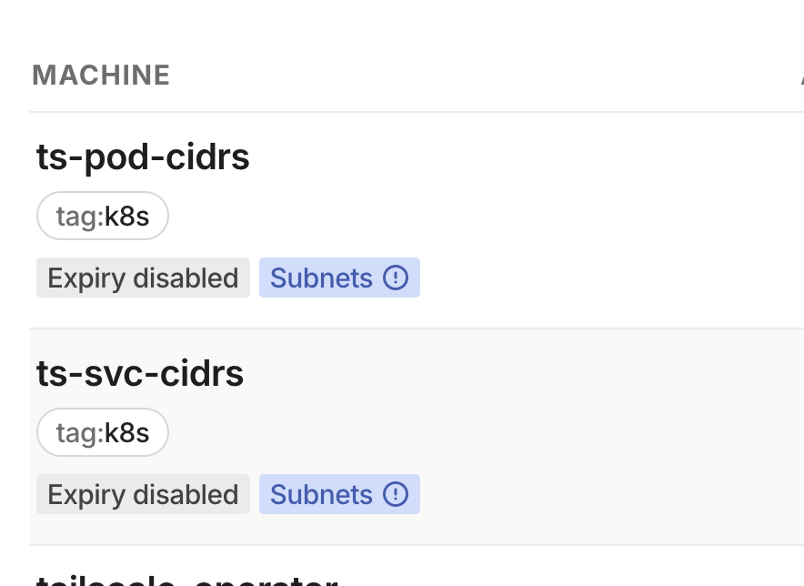
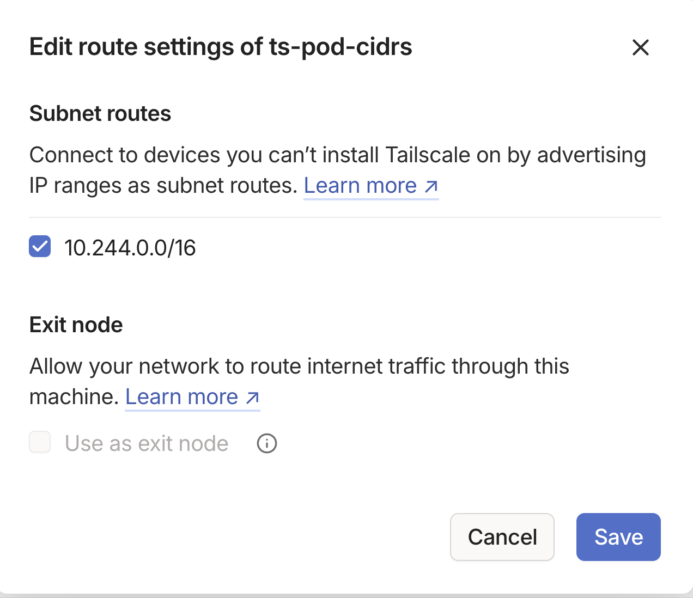

# Connectors

Connectors are the Kubernetes custom resource for a subnet router. A connector will allow you to use Tailscale to connect to any address within the connectors cidr block.

We'll use the connector to advertise the Kubernetes pod CIDR as well as the service CIDR.

## Get Kubernetes pod CIDR range

We'll need to retrieve the pod CIDR for your cluster. Each CNI hands this out differently, so you may not be able to retrieve this easily from `kubectl` - refer to your Kubernetes provider for more information. The following are some examples that may work

```bash
kubectl cluster-info dump | grep -m 1 podCIDR
```

### GKE

```bash
gcloud container clusters describe <cluster-name> --region=<region>
```

### AKS

```bash
az aks show --resource-group <rg> --name <cluster-name> --query networkProfile.podCidr
```

### DOKS

```bash
doctl kubernetes cluster get <cluster id> --format ClusterSubnet
```

### Minikube

```
minikube ssh "cat /var/lib/kubelet/config.yaml | grep -i podCIDR"
```

## Get Kubernetes service CIDR range

Similarly, we'll need to find the service CIDR. Managed services usually have a default, but consult your provider for more information.

### Minikube

```bash
kubectl cluster-info dump | grep -m 1 service-cluster
```

### DOKS

```bash
doctl kubernetes cluster get <cluster-id> --format ServiceSubnet
```

## Create the connector

Create the following YAML file:

```yaml
apiVersion: tailscale.com/v1alpha1
kind: Connector
metadata:
  name: ts-pod-cidrs
spec:
  hostname: ts-pod-cidrs
  subnetRouter:
    advertiseRoutes:
      - "<your-pod-cidr-range>"
---
apiVersion: tailscale.com/v1alpha1
kind: Connector
metadata:
  name: ts-svc-cidrs
spec:
  hostname: ts-svc-cidrs
  subnetRouter:
    advertiseRoutes:
      - "<your-service-cidr-range>"
```

## Verify

Once you have applied the connector configurations, you should see two new devices in your tailnet.



Note, the routes we have advertised are not yet approved (notice the Subnet (!)) indictator

Navigate to each device and approve the routes.



### Use `tailscale ping` for a pod

Find a pod in the cluster:

```bash
kubectl get pods -A -o wide
```

Use `tailscale ping` to verify connectivity to it

```bash
tailscale ping 10.244.0.45
pong from ts-pod-cidrs (100.74.174.48) via 143.110.148.7:47770 in 44ms
```

### Use `tailscale ping` for a svc

Find a service in the cluster:

```bash
kubectl get svc -A -o wide
```

Use `tailscale ping` to verify connectivity to it

```bash
tailscale ping 10.245.0.1
pong from ts-svc-cidrs (100.64.76.28) via DERP(sfo) in 37ms
pong from ts-svc-cidrs (100.64.76.28) via DERP(sfo) in 37ms
pong from ts-svc-cidrs (100.64.76.28) via DERP(sfo) in 41ms
pong from ts-svc-cidrs (100.64.76.28) via 143.110.148.7:54806 in 35ms
```

