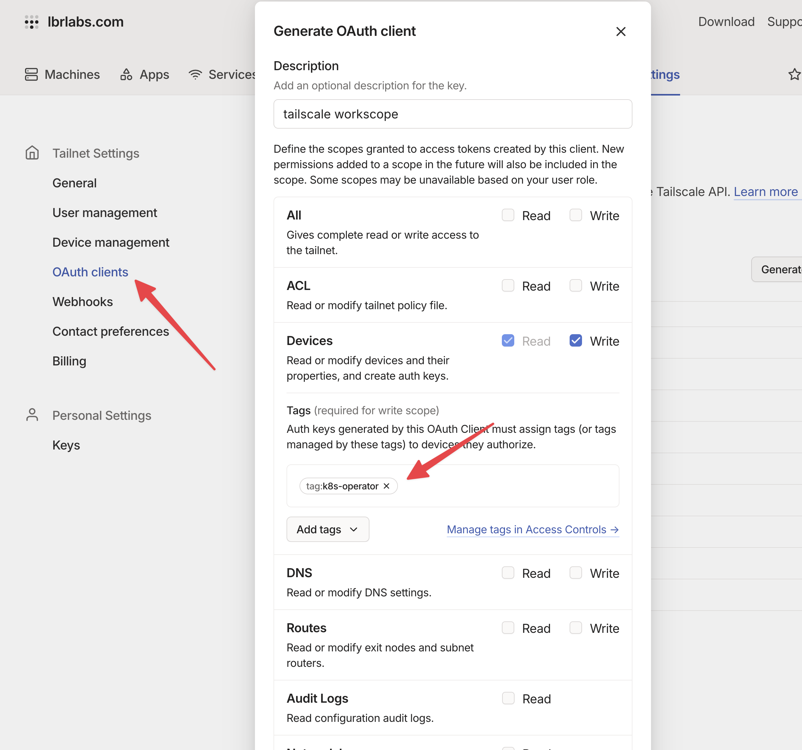

# Install the Operator

The Tailscale Kubernetes operator is the easiest way to use Tailscale with Kubernetes, and provides several features we'll explore in this workshop.

The first step is to install it in your cluster, and to do that, you first need to create some credentials and modify your Tailscale ACL.

## Update your ACL file

In your tailnet policy file, create the tags `tag:k8s-operator` and `tag:k8s`, and make `tag:k8s-operator` an owner of `tag:k8s`. If you want your Services to be exposed with tags other than the default `tag:k8s`, create those as well and make `tag:k8s-operator` an owner.

```json
"tagOwners": {
   "tag:k8s-operator": [],
   "tag:k8s": ["tag:k8s-operator"],
}
```
Related docs: [Group devices with tags](https://tailscale.com/kb/1068/tags)

## Create an OAuth client

Create an OAuth client in the OAuth clients page of the admin console. Create the client with Devices write scope and the tag tag:k8s-operator.



Related docs: [OAuth Clients](https://tailscale.com/kb/1215/oauth-clients)

# Install the operator

Add the operator helm repository to your local helm repositories

```bash
helm repo add tailscale https://pkgs.tailscale.com/helmcharts
```

Then, install the operator with your oauth credentials.

Firstly, set the oauth secret with an env var so you can copy and paste the installation command

```bash
export TS_OAUTH_CLIENT_ID=<your client id>
export TS_OAUTH_SECRET=<you secret>
```

```bash
helm upgrade \
  --install \
  tailscale-operator \
  tailscale/tailscale-operator \
  --namespace=tailscale \
  --create-namespace \
  --set-string oauth.clientId="${TS_OAUTH_CLIENT_ID}" \
  --set-string oauth.clientSecret="${TS_OAUTH_SECRET}" \
  --wait
```

# Verify installation

Verify the Tailscale operator is working as expected:

```bash
kubectl get pods -n tailscale
```

You should also see a Tailscale operator node in the Tailscale console.


<div class="alert-note">
  ⚠️ Make sure you see the information (https://tailscale.com/kb/1080/cli)[here] about using the CLI, especially for OS X! You may need to add an alias or install the CLI via the Mac app
</div>

This new pod has given you connectivity to another Tailscale device. You can see it in `tailscale status`

```bash
tailscale status
100.70.230.73   macbook-pro-lbr      jaxxstorm@   macOS   -
100.77.176.118  tailscale-operator   tagged-devices linux   -
```

And connect to it via `tailscale ping`

```bash
tailscale ping tailscale-operator
```

---
## Continue to [Enable the Auth Proxy](authproxy.md)